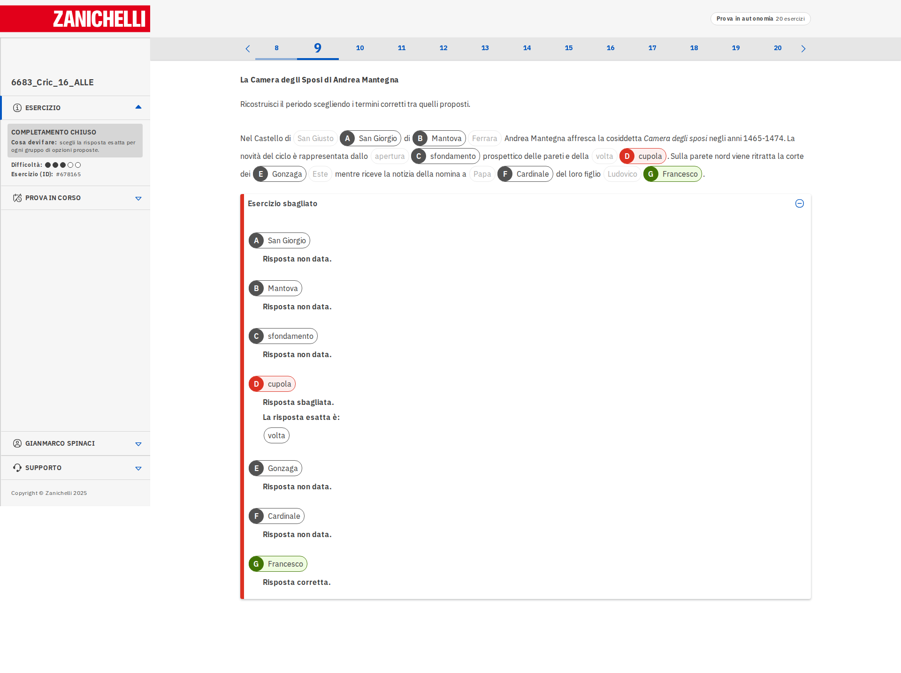
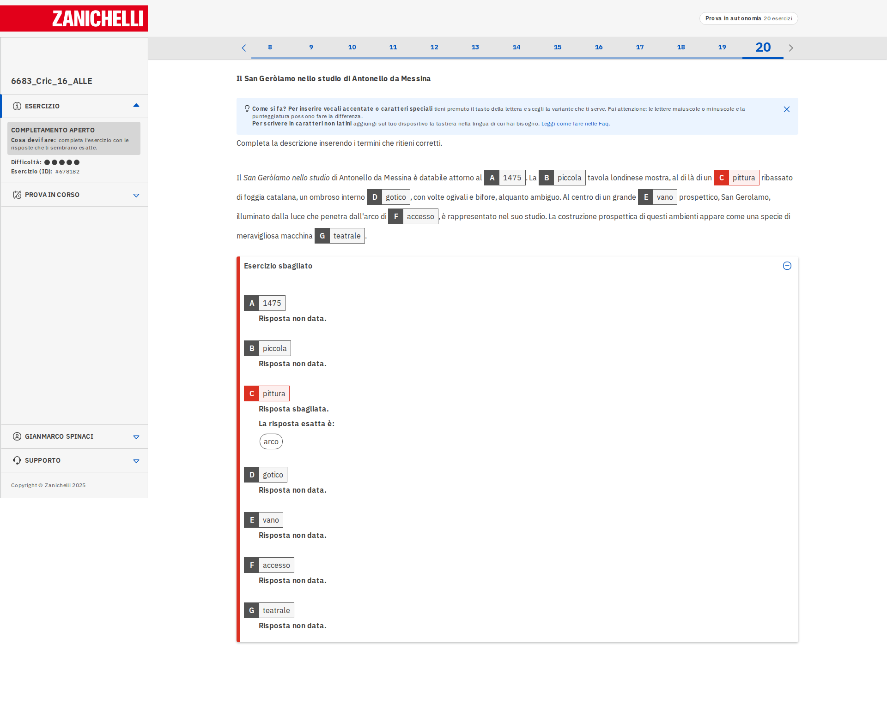
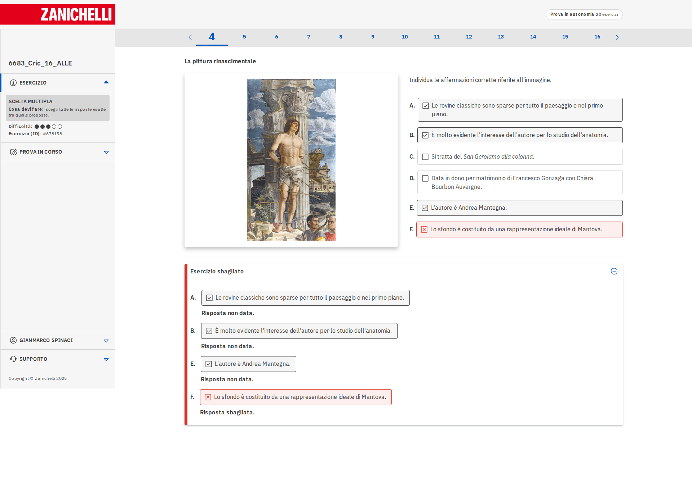
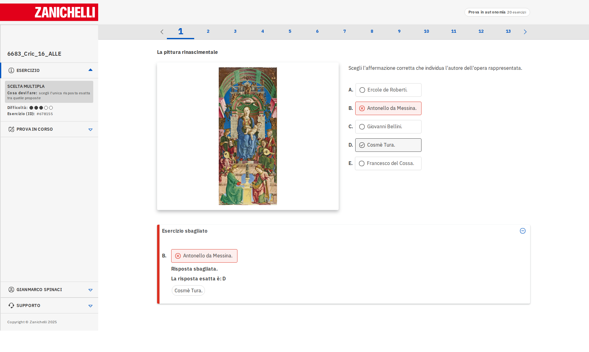
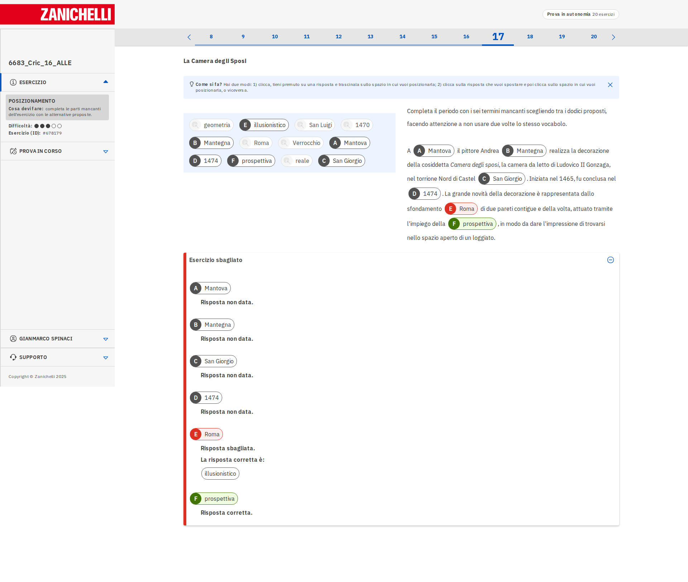
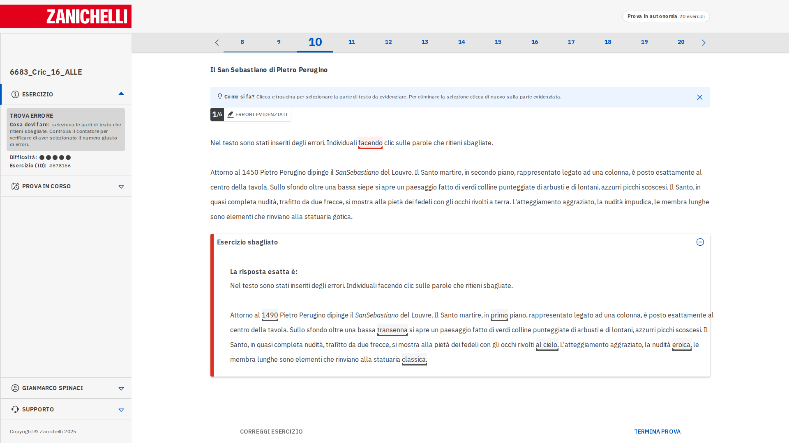
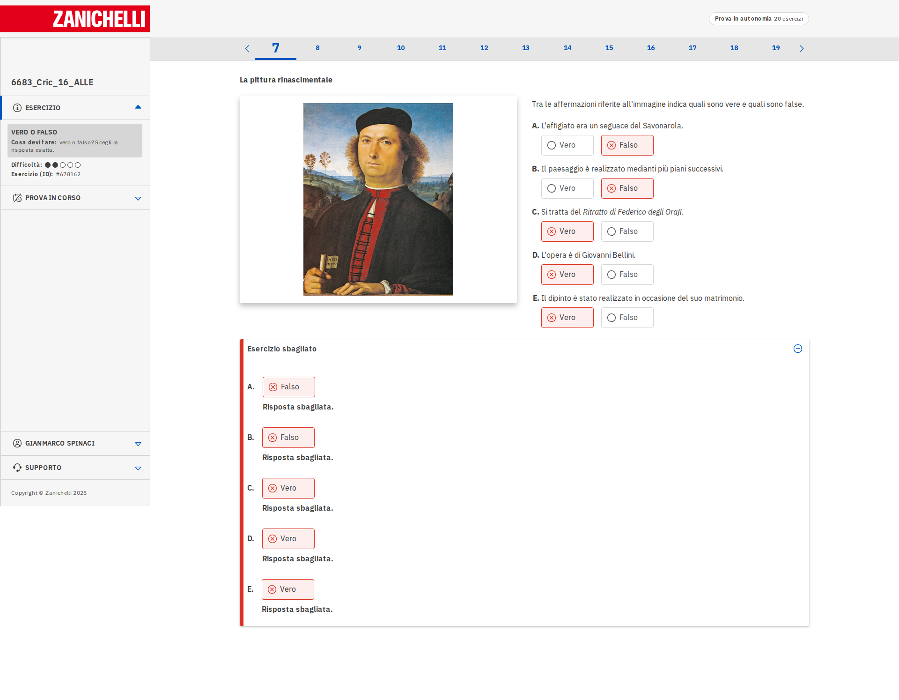

# Dataset Bundle Report

**Creation Date & Time:** 2026-03-24 18:55:15

**Processing Time:** 3.87 seconds

**Version:** 2.9

**Number of Sources:** 63

**Number of Questions:** 871

**Questions with Images:** 436

**Total Cost:** $0.0000

## Questions by Type

- **completion_closed:** 69
  - Example:  (from myzanichelli/1, exercise 1, question 9)
- **completion_open:** 75
  - Example:  (from myzanichelli/1, exercise 1, question 20)
- **multiple_choice_check:** 117
  - Example:  (from myzanichelli/1, exercise 1, question 4)
- **multiple_choice_radio:** 370
  - Example:  (from myzanichelli/1, exercise 1, question 1)
- **positioning:** 108
  - Example:  (from myzanichelli/1, exercise 1, question 17)
- **select_errors:** 49
  - Example:  (from myzanichelli/1, exercise 1, question 10)
- **true_false:** 83
  - Example:  (from myzanichelli/1, exercise 1, question 7)

## Categorization Statistics

### Language

| Value | completion_closed | completion_open | multiple_choice_check | multiple_choice_radio | positioning | select_errors | true_false | Total |
|-------|-------|-------|-------|-------|-------|-------|-------|-------|
| it | 69 | 75 | 117 | 167 | 108 | 49 | 83 | 668 |
| en | 0 | 0 | 0 | 203 | 0 | 0 | 0 | 203 |

### With/Without Image

| Has Image | completion_closed | completion_open | multiple_choice_check | multiple_choice_radio | positioning | select_errors | true_false | Total |
|-----------|-------|-------|-------|-------|-------|-------|-------|-------|
| Yes | 21 | 10 | 93 | 253 | 9 | 14 | 36 | 436 |
| No | 48 | 65 | 24 | 117 | 99 | 35 | 47 | 435 |

## Sources

- ap_art_history/2010
- ap_art_history/2011
- ap_art_history/2012
- ap_art_history/2013
- ap_art_history/2014
- ap_art_history/2015
- myzanichelli/1
- myzanichelli/10
- myzanichelli/11
- myzanichelli/12
- myzanichelli/13
- myzanichelli/14
- myzanichelli/15
- myzanichelli/16
- myzanichelli/17
- myzanichelli/18
- myzanichelli/19
- myzanichelli/2
- myzanichelli/20
- myzanichelli/21
- myzanichelli/22
- myzanichelli/23
- myzanichelli/24
- myzanichelli/25
- myzanichelli/26
- myzanichelli/27
- myzanichelli/28
- myzanichelli/29
- myzanichelli/3
- myzanichelli/30
- myzanichelli/31
- myzanichelli/32
- myzanichelli/33
- myzanichelli/34
- myzanichelli/35
- myzanichelli/36
- myzanichelli/37
- myzanichelli/38
- myzanichelli/39
- myzanichelli/4
- myzanichelli/40
- myzanichelli/41
- myzanichelli/42
- myzanichelli/43
- myzanichelli/44
- myzanichelli/45
- myzanichelli/46
- myzanichelli/47
- myzanichelli/48
- myzanichelli/49
- myzanichelli/5
- myzanichelli/50
- myzanichelli/51
- myzanichelli/52
- myzanichelli/53
- myzanichelli/54
- myzanichelli/55
- myzanichelli/56
- myzanichelli/57
- myzanichelli/6
- myzanichelli/7
- myzanichelli/8
- myzanichelli/9

---
*Report generated automatically by dataset bundler script*
*Last updated: 2026-03-24 18:55:19*
